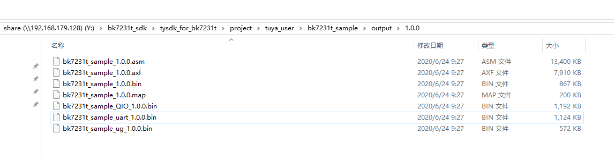

# BK7231T SDK使用及编译说明

bk7231t SDK的是基于Tuya Device OS 技术体系按照物联网 Wi-Fi 应用场景，进行裁剪、定制得到的，包括了库文件、编译工具链以及编译脚本，不需要用户进行任何其他的配置，直接就可以在当前的 SDK 产物目录环境下，进行开发、编译操作。

# 工程文件结构

​	工程文件结构基本参考 SDK目录结构，其中开发的应用工程请放在project/tuya_user/路径下，创建以工程名为命名的文件夹。工程文件夹内的内容可参考bk7231t_sample；

## 工程编译

在主目录下，使用build_app.sh脚本进行编译；

​		格式：

​     	 	sh build_app.sh xxx（工程名） 1.1.2（版本）

​		clean的格式：

​	 		sh build_app.sh xxx（工程名） 1.1.2（版本） clean

编译的输出结果，生成的文件在工程文件的output文件夹内（e.g: project/tuya_user/xxx（工程名）/output）

生成的文件有（如下图示）

主要的生成的文件的简述：

1. uart文件 -- 用户区文件；
2. QIO文件 -- BootLoader+用户区文件；
3. ug文件 -- OTA升级文件；

