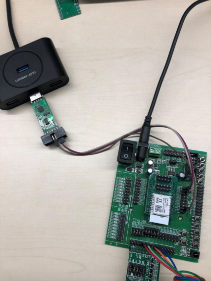

bk7231t SDK烧录和授权说明

## 简述

bk7231t支持使用Beken工具烧录uart用户区固件、烧录QIO文件，使用涂鸦云模组烧录授权工具烧录uart用户区固件和授权；

## bk7231t Beken工具烧录UART用户区固件

环境及工具：

1. usb2ttl（ch340/cp2102）;
2. Beken Write工具；

烧录步骤：

 1. 将模组的TX1、RX1通过串口工具连接到usb；
    
  2. 打开beken软件

​       选择芯片平台：BK7231，选择烧录的uart.bin 文件，选择对应的串口，点击烧录；

3. 点击“烧录“开始稍后后，耗时这个数据会一直的递增，当时间为1s左右时，模块断电，等2-4s，模块上电（断电上电的时间以实际操作为准），触发进入烧录模式，进度条会有进度更新；

## bk7231t Beken工具烧录QIO固件以及dump flash数据

bk7231t固件由BootLoader+用户区两部分组成，一般情况下，无需单独更新BootLoader，但是当BootLoader版本更新时需要通过烧录QIO固件的方式进行更新。通过SPI烧录也可以进行flash的读取。

### SPI烧录QIO

环境及工具：

 	1. Beken SPI烧录器；
     
 	2. Hid Download Tool；

烧录QIO固件的方式：

​      1. 使用涂鸦开发的模组转接底板时，仅需要将Beken SPI烧录器按照如下图进行连接。

​			如果未使用涂鸦模组转接底板，请按照如下图接线（HW SPI），线序为：

| **bk烧录工具** | MOSI | MISO | P2.4 | P2.3 | GND  | GND  | VPP  | VCC  | CS   | WP   |
| -------------- | ---- | ---- | ---- | ---- | ---- | ---- | ---- | ---- | ---- | ---- |
| **原厂Demo板** | SI   | SO   | /    | SCK  | /    | GND  | CEN  | VBAT | CSN  | /    |
| **T33**        | SI   | SO   | /    | SCK  | /    | GND  | CEN  | VCC  | CS   | /    |

原厂Demo板直接插入即可。

2. 打开软件工具

​       配置软件：下载模式->接口选择->SPI HARD式；芯片擦除方式->擦除程序空间；芯片控制选择BK7231U；

​		Attention：擦除方式一定要选择擦除程序空间！（由于wifi射频校正数据存储在flash区，擦除所有空间，就会擦除掉这些数据，wifi联网性能就会收到影响！并且在使用涂鸦授权时会报错！）

 3. 选择需要烧录的QIO文件；

     

 4. 点击下载Flash按钮开始固件

    

 5. 下载完成；

    注：此烧录器仅在下载过程为开发板提供电源，平时调试时，需要将SPI下载器拔掉，通过串口给模组供电工作。
    
    

​        

### SPI flash 读取

​	当需要读取flash进行异常分析时，使用SPI烧录器连接模组之后，按照如下图进行flash的读取；

   读取出flash文件如下所示

## bk7231t 烧录授权

​	接入涂鸦云，设备需要进行授权操作。涂鸦烧录工具：云模组烧录授权平台；

​	烧录工具设置的界面。如果已经烧录过特定的版本的UART固件，仅需要烧录，就可以通过设置页面进行设置。如果不开启“只授权”就会重新烧录UART固件+授权；

Attention：如果测试用的模组已经联网在网累计时长超过15min，无法进行再次授权操作；

​	具体的烧录步骤：

  		1. 平台下单，获取授权码，工具使用授权码方式进行烧录；
         

   2. 将模组的TX1和RX1连接到USB上，并选择正确的串口；

       

 3. 授权成功；

    

